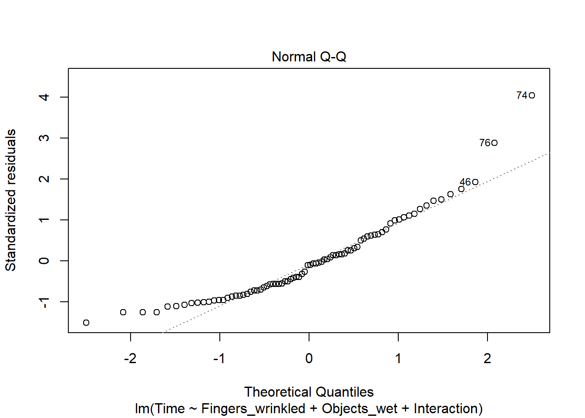
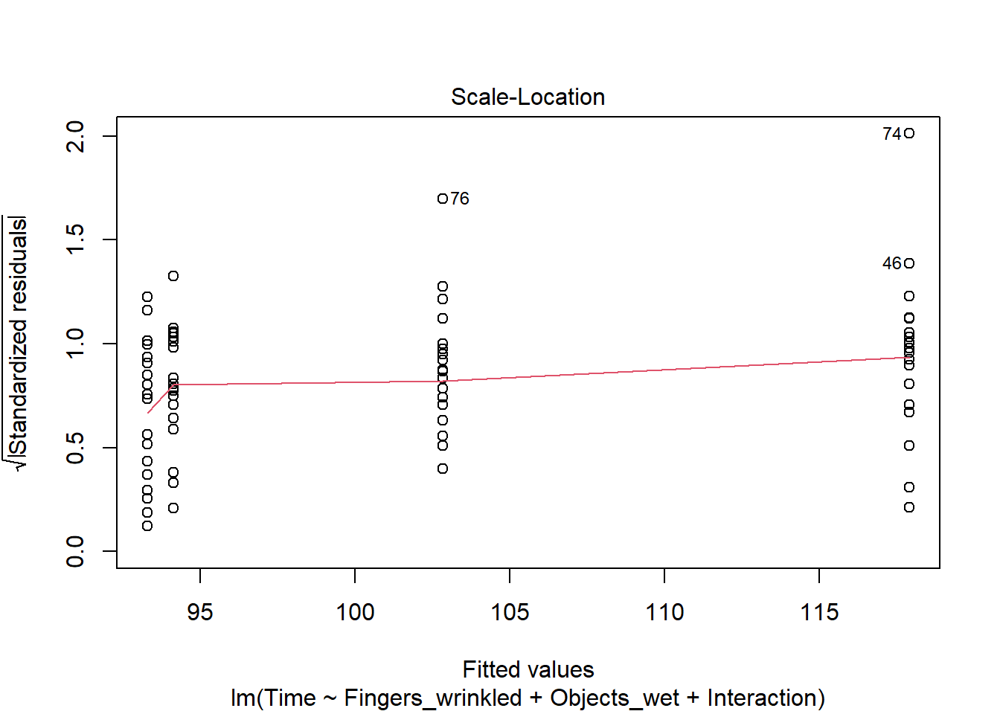

---
editor_options:
  markdown:
    wrap: 72
---

# Answers {-}

*Section 1 Demonstration: An Introduction to `lavaan`: How Do Wet Fingers Wrinkle?*

<script>
function revealContent() {
  var code = document.getElementById("codeInput").value;
  if (code === "DASS_S1_FW") {  
    document.getElementById("hiddenContent").style.display = "block";
  } else {
    alert("Incorrect code!");
  }
}
</script>

<p>Enter the code provided on Blackboard to view the answers:</p>
<input type="text" id="codeInput">
<button onclick="revealContent()">Submit</button>

<div id="hiddenContent" style="display:none;">


## Task 1 {-}

Fit a linear model using `lm()` to evaluate the effect of the predictors
**Fingers** and **Objects**, and their interaction, on outcome **Time**.

Are the specific hypotheses supported by the data?   


Let's fit the model. 


```r
fit_lm <- lm(Time ~ Fingers_wrinkled + Objects_wet + Interaction, data = wrinkle2)

summary(fit_lm)
```

```
## 
## Call:
## lm(formula = Time ~ Fingers_wrinkled + Objects_wet + Interaction, 
##     data = wrinkle2)
## 
## Residuals:
##     Min      1Q  Median      3Q     Max 
## -29.900 -15.113  -2.025  11.925  80.100 
## 
## Coefficients:
##                  Estimate Std. Error t value Pr(>|t|)    
## (Intercept)        93.300      4.539  20.554  < 2e-16 ***
## Fingers_wrinkled    0.850      6.420   0.132  0.89501    
## Objects_wet        24.600      6.420   3.832  0.00026 ***
## Interaction       -15.900      9.079  -1.751  0.08391 .  
## ---
## Signif. codes:  0 '***' 0.001 '**' 0.01 '*' 0.05 '.' 0.1 ' ' 1
## 
## Residual standard error: 20.3 on 76 degrees of freedom
## Multiple R-squared:  0.1997,	Adjusted R-squared:  0.1681 
## F-statistic: 6.323 on 3 and 76 DF,  p-value: 0.0006927
```

If we explore the residuals, we can note that none of the plots reveals a major problem.


```r
plot(fit_lm)
```



```
## hat values (leverages) are all = 0.05
##  and there are no factor predictors; no plot no. 5
```



Substantive interpretation of the coefficients:

|                   |           |                                                                  |
|----------------|----------|----------------------------------------------|
| **Coefficient**   | **Value** | **Interpretation**                                               |
| Intercept         | 93.300    | Mean time to handle dry objects with dry hands                   |
| Fingers_wrinkled  | 0.850     | Additional time to handle dry objects with wet hands             |
| Objects_wet       | 24.600    | Additional time to handle wet objects with dry hands Interaction |
| Interaction       | 15.900    | Difference from above when handling wet objects with wet hands   |


The pattern of coefficients supports the hypotheses: Handling wet objects with dry hands takes on average $24.6$ seconds longer than handling dry objects with  dry hands, but if the hands are wet when handling the wet objects, it takes $15.9$ seconds less than this: It takes $24.6$ seconds longer to handle wet objects with dry hands than dry objects with dry hands. It takes $24.6 - 15.9 = 8.7$ seconds longer to handle wet objects with wet hands than it takes to handle dry objects with dry hands.  

However, the SE for the Interaction is $9.079$, so the $95%$ confidence interval is:  

Lower Bound $CI_{95\%} = -15.9 - (2 \times 9.079) = -34.058$

Upper bound $CI_{95\%} = -15.9 + (2 \times 9.079)  = 2.258$   

This shows us the plausible range of values for the interaction in the population. This range includes zero - the effect could plausibly be zero in the population. The interaction effect is therefore non-significant. The key hypothesis of an interaction between Fingers and Wrinkled is **not** supported by the results of this model.


## Task 2 {-}

What are the differences between the `lm()` and `lavaan` results? Why might these differences exist?  

The estimates for the b coefficients are exactly the same. The standard errors are all a bit smaller. This is because this model was not estimated using OLS. By default, `lavaan` uses "maximum likelihood" (ML) estimation. ML uses an iterative algorithm that selects the model parameters that were "most likely" to  have resulted in the observed data. ML makes an additional assumption that OLS does not - it assumes the residuals are normally distributed. If the residuals are plausibly from a normal distribution, the ML estimator is more "efficient", especially in small samples. "Efficient"  means that it has smaller standard errors. Because the SEs are slightly smaller, the p-values are also slightly lower. However, the Interaction effect is still non-significant ($p=0.072$).   

`lavaan` hasn't given us $R^2$, but we can work it out for ourselves:  

$R^2 = \frac{(var_0 - var_1)}{var_0}$, where $var_0$ is the variance of the outcome variable, and $var1$ is the variance of the residuals after fitting the model.  

From the output, we find that $var_1$ (residual variance of Time) is $391.489$. We can then obtain $var_0$ by: 


```r
var_0 <- var(wrinkle2$Time)
```

Therefore, $R^2 = \frac{(495.3899 - 391.489)}{495.3899} = 0.21$   

This is slightly higher than the value computed by `lm()`, because `lavaan` uses the sample size $N$ to compute variances, rather than $N-1$ as `lm()` does.  

*TIP: To get the same $R^2$ as `lm()`, include the option: `likelihood = "wishart"` in the model estimation command.*  


An assumption of both `lm()` and `lavaan` models above is that the observations are independent. Let's see:


```r
glimpse(wrinkle2)
```

```
## Rows: 80
## Columns: 14
## $ rownames         <int> 1, 21, 41, 61, 2, 22, 42, 62, 3, 23, 43, 63, 4, 24, 4…
## $ Participant      <chr> "p1", "p1", "p1", "p1", "p2", "p2", "p2", "p2", "p3",…
## $ id               <dbl> 1, 1, 1, 1, 2, 2, 2, 2, 3, 3, 3, 3, 4, 4, 4, 4, 5, 5,…
## $ Time             <int> 106, 139, 107, 118, 113, 138, 97, 106, 94, 136, 117, …
## $ Condition        <chr> "non-wrinkled/dry", "non-wrinkled/wet", "wrinkled/dry…
## $ Fingers          <chr> "non", "non", "wrinkled", "wrinkled", "non", "non", "…
## $ Objects          <chr> "dry", "wet", "dry", "wet", "dry", "wet", "dry", "wet…
## $ WrinkledThenNon  <int> 1, 1, 1, 1, 2, 2, 2, 2, 1, 1, 1, 1, 2, 2, 2, 2, 1, 1,…
## $ DryThenWet       <int> 1, 1, 1, 1, 1, 1, 1, 1, 1, 1, 1, 1, 1, 1, 1, 1, 1, 1,…
## $ Fingers_non      <int> 1, 1, 0, 0, 1, 1, 0, 0, 1, 1, 0, 0, 1, 1, 0, 0, 1, 1,…
## $ Fingers_wrinkled <int> 0, 0, 1, 1, 0, 0, 1, 1, 0, 0, 1, 1, 0, 0, 1, 1, 0, 0,…
## $ Objects_dry      <int> 1, 0, 1, 0, 1, 0, 1, 0, 1, 0, 1, 0, 1, 0, 1, 0, 1, 0,…
## $ Objects_wet      <int> 0, 1, 0, 1, 0, 1, 0, 1, 0, 1, 0, 1, 0, 1, 0, 1, 0, 1,…
## $ Interaction      <int> 0, 0, 0, 1, 0, 0, 0, 1, 0, 0, 0, 1, 0, 0, 0, 1, 0, 0,…
```

There are only 20 participants, but there are 80 rows of data: Each participant did the task four times, and has four rows of data.  These observations are therefore not independent, they are clustered  within participants. This violates the independence assumption of the  residuals in these simple linear models.    

What can we do?   

With `lavaan`, we can relax this assumption by allowing for the clustering  when computing the model SEs (the independence assumption only affects the SEs, not the b-values themselves.


```r
fit_lav_clus <- sem(model, data = wrinkle2, meanstructure = TRUE, 
                    cluster = "Participant")
```

The `cluster` command tells `lavaan` that the observations (rows) are clustered within values of **Participant**. It then computes "robust" SEs, taking this non-independence into account.


```r
summary(fit_lav_clus)
```

```
## lavaan 0.6-18 ended normally after 1 iteration
## 
##   Estimator                                         ML
##   Optimization method                           NLMINB
##   Number of model parameters                         5
## 
##   Number of observations                            80
##   Number of clusters [Participant]                  20
## 
## Model Test User Model:
##                                               Standard      Scaled
##   Test Statistic                                 0.000       0.000
##   Degrees of freedom                                 0           0
## 
## Parameter Estimates:
## 
##   Standard errors                        Robust.cluster
##   Information                                  Observed
##   Observed information based on                 Hessian
## 
## Regressions:
##                    Estimate  Std.Err  z-value  P(>|z|)
##   Time ~                                              
##     Fingers_wrnkld    0.850    2.573    0.330    0.741
##     Objects_wet      24.600    3.833    6.418    0.000
##     Interaction     -15.900    2.365   -6.722    0.000
## 
## Intercepts:
##                    Estimate  Std.Err  z-value  P(>|z|)
##    .Time             93.300    3.191   29.243    0.000
## 
## Variances:
##                    Estimate  Std.Err  z-value  P(>|z|)
##    .Time            391.489  139.008    2.816    0.005
```


## Task 3 {-}

How have the results changed after relaxing the independence assumption?
Would your answer to the research question change?  

YES! The values of the b-coefficients have not changed, but the SEs are now  corrected for clustering within participants and are now very much smaller  than before. (This is unusual - for much social data we would expect the SEs to be larger after correction for clustering, but this was a well-designed experiment where the clustering was "explained" by the design.)  


The SE for the Interaction is $2.365$, so the $95%$ confidence interval is:  

Lower Bound $CI_{95\%} = -15.9 - (2 \times 2.365) = -20.63$   

Upper bound $CI_{95\%} = -15.9 + (2 \times 2.365) = -11.17$   

The $95%$ confidence interval does NOT include zero! The plausible population values for the improvement in handling time for wet objects when the hands are wet/wrinkled compared to dry is now between $11.17$ and $20.63$ seconds faster.   


**In summary, `lavaan` can do everything that `lm()` can do, and much, much more as we will see. But be aware that there are differences, for example in the default methods for model estimation (ML vs OLS).**

