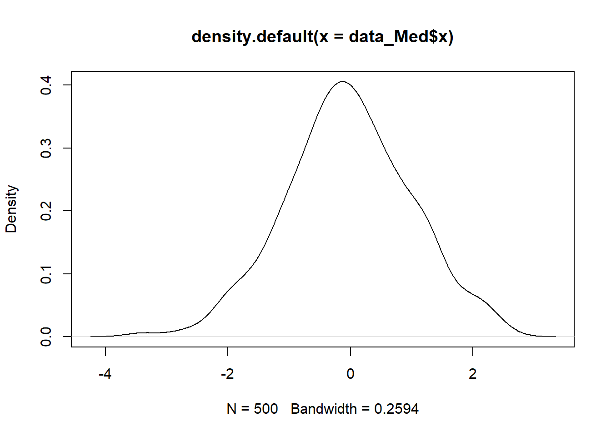

---
editor_options:
  markdown:
    wrap: 72
---

# Fitting and interpreting a cross-sectional mediation model {.unnumbered}

Before we start, install the `lavaanPlot` package.


```r
install.packages('lavaanPlot')
```

And then load the installed package as well as the `lavaan` package.


```r
library(lavaan)
library(lavaanPlot)
```

## 1. Creating a Simulated Dataset {.unnumbered}

We will create a simulated dataset called **data_Med** which will
contain 500 cases (the default) of three variables:

-   **x**, the exogenous cause ("exogenous" means it is not caused by
    any other variable in the model);\
-   **m**, the mediator (which is a outcome of x, but an "endogenous"
    cause of y);\
-   **y**, the outcome.

### The Population Model {.unnumbered}

The 500 cases we will create will be drawn randomly from a "population
model". This is the model of the causal relationships that exist in the
population between the variables. We will then "draw" a sample of 500
cases from this population, each with a value of **x**, **m**, and
**y**, that is a result of the model.

Here is an example of a population model:\
$$
y \sim 0.5m + 0.2x + e
$$ This means that variable $y$ is a function of variables $m$ and $x$.

The $\beta$ coefficient in the population for **m** predicting **y** is
$0.5$, in standardised units (i.e. for one standard deviation difference
in **m** we would expect to see one half of a standard deviation
difference in **y**).

The $b$ coefficient for **x** predicting **y** is $0.2$, so for one standard deviation in **x** we would expect to see $0.2$ standard deviations difference in **y**. The value of **y** is also affected by $e$. This is the error term, which is just a random value that is added to **y**, to represent the fact that **m** and **x** are not the only causes of **y** - there will be other causes that we have not included in the model. The mean of $e$ is $0$, so that on average it doesn't bias the values of **y** systematically up or down. Its standard deviation is $1$.

Here is the population model for our mediation model. It is more complex
than the example above, because there are two endogenous variables (i.e.
variables caused by something else in the model). We don't need to
specify the error terms, because they are included by default, but both
**m** and **y** will have error terms.

$$
\begin{aligned}
\text{pop_Med} \quad & \begin{cases}
m & \sim -0.6x \\
y & \sim 0.9m + 0.1x
\end{cases}
\end{aligned}
$$

What is this a model of? It's designed to represent the example of
dental health in the material for mediation models.  

**y** is the outcome, dental health, e.g. level of tooth decay.  

**x** is tooth brushing, which is a causal influence on **y**.  

**m** is a measure of bacteria in the mouth. This is a cause of tooth decay, but it itself influenced (negatively) by tooth brushing.  

For the purposes of this simulation, we will assume that variables **x**,
**m**, and **y**, have been standardised (i.e. they have a mean of $0$ and a
standard deviation of $1$). The model shows that tooth decay (**y**) is
strongly positively influenced by bacteria (**m**), and weakly influenced
by tooth brushing (**x**). However, tooth brushing has a pretty strong
negative affect on bacteria ($-0.6$).

Let's now generate 500 cases based on this population model.

First we set a "seed" number so we can re-create exactly the same data
every time.


```r
set.seed(1234)
```

Then we generate the data.


```r
pop_Med     <- ' m ~ -0.6*x 
                 y ~  0.9*m + 0.1*x
               '

data_Med <- simulateData(pop_Med)
```

Now, let's take a look at the first few rows of the data


```r
head(data_Med)
```

```
##             m           y          x
## 1  0.52600181  2.36709958 -0.2363440
## 2  0.06079546 -1.02468167 -0.7180904
## 3 -1.99379425 -0.66757120  0.7562848
## 4  2.78590294  2.84225973 -1.2425802
## 5 -0.41943615  0.09772246  1.8211988
## 6 -1.39856627 -0.26645819 -0.4124773
```

The values of **x** were not specified in the population model, as they are exogenous. For the model, they just represent draws from a standard normal distribution.We can see this distribution by plotting the density of **x**.


```r
plot(density(data_Med$x))  
```



Let's have a look at the sample correlations.


```r
round(cor(data_Med), 3)
```

```
##        m      y      x
## m  1.000  0.733 -0.610
## y  0.733  1.000 -0.416
## x -0.610 -0.416  1.000
```

The correlation between **x** and **m** is $-0.61$, which is very close to
the value of $0.6$ in the population model, but it not exactly the same because we have random error in our model. The interpretation of the correlations between **y** and the other variables is not so straightforward, because they are affected by more than one variable.

When we analyse these data with `lavaan`, we will actually be analysing
the covariances among the variables, not the correlations. The covariances are unstandardised, and so are dependent by the scale of the variables. They are not bound to be between $-1$ and $1$, as correlations are.


```r
round(cov(data_Med), 3)
```

```
##        m      y      x
## m  1.363  1.227 -0.730
## y  1.227  2.058 -0.612
## x -0.730 -0.612  1.050
```

## 2. Estimating the Mediation Model {.unnumbered}

We now have a dataset to analyse called **data_Med**. We next need to specify a statistical model that we will use to analyse the data. Note that we have a big advantage here compared to poor researchers who analyse messy, real world data: we know the true model that generated the data.

### 2.1 Specify the statistical model: {.unnumbered}


```r
model_Med       <- ' m ~ x 
                     y ~ m + x
                   '
```

You'll see that this looks just like the population model! The only difference is that we haven't specified the strengths of relationships among the variables. These will be estimated from the data.  

Now we fit the model to the data.


```r
fit_Med <- sem(model_Med, data = data_Med)
```

We can use the `lavaanPlot` library to plot the path diagram implied by the analysis model.


```r
lavaanPlot(model = fit_Med)
```

```{=html}
<div class="grViz html-widget html-fill-item" id="htmlwidget-aeee114d5979fcdad4ae" style="width:672px;height:480px;"></div>
<script type="application/json" data-for="htmlwidget-aeee114d5979fcdad4ae">{"x":{"diagram":" digraph plot { \n graph [ overlap = true, fontsize = 10 ] \n node [ shape = box ] \n node [shape = box] \n x; m; y \n node [shape = oval] \n  \n \n edge [ color = black ] \n x->m m->y x->y  \n}","config":{"engine":"dot","options":null}},"evals":[],"jsHooks":[]}</script>
```

From the plot we see that:  

-   The indirect path is:  
    $x \rightarrow m$ (path $a$) and $m \rightarrow y$ (path $b$)  
    The full indirect path is $a*b$.  

-   The direct effect is:\  
    $x \rightarrow y$ (path $c'$)  

We can look at the table of results. 


```r
summary(fit_Med)
```

```
## lavaan 0.6-18 ended normally after 1 iteration
## 
##   Estimator                                         ML
##   Optimization method                           NLMINB
##   Number of model parameters                         5
## 
##   Number of observations                           500
## 
## Model Test User Model:
##                                                       
##   Test statistic                                 0.000
##   Degrees of freedom                                 0
## 
## Parameter Estimates:
## 
##   Standard errors                             Standard
##   Information                                 Expected
##   Information saturated (h1) model          Structured
## 
## Regressions:
##                    Estimate  Std.Err  z-value  P(>|z|)
##   m ~                                                 
##     x                -0.695    0.040  -17.214    0.000
##   y ~                                                 
##     m                 0.938    0.047   19.907    0.000
##     x                 0.069    0.054    1.281    0.200
## 
## Variances:
##                    Estimate  Std.Err  z-value  P(>|z|)
##    .m                 0.854    0.054   15.811    0.000
##    .y                 0.947    0.060   15.811    0.000
```

Like the results from the simple regression model, the $b$ coefficients telling us the strengths of the relationships among the variables are in the section under `Regressions`. The results aren't easy to interpret unless we remember which regressions belong to which paths.  

For example, which regression represents the $c'$ mediation path? (It's `y ~ x`, which is $0.069$, but that's not obvious).  

We can make the results easier to interpret by adding labels to the coefficients. We can also use these labels to get `lavaan` to compute the indirect and total effects for us.

### 2.2 Adding labels {.unnumbered}

We are going to add a text label to each arrow/path in the diagram:   

-  The labels are $a$, $b$, and $c$   
-  $a$ is for the path between predictor **x** and mediator **m** variable    
-  $b$ is for the path between the mediator **m** and the outcome **y** variable   
-  $c$ is for the path between the predictor **x** and the outcome **y** variable    

We write each label before the variable name, and we "attach" the label by multiplying it with the variable:


```r
model_Med_lab    <- ' m ~ a*x 
                      y ~ b*m + c*x
                    '
```

Note that I've used the label $c$ rather than $c'$, because the prime symbol $'$ is used by `lavaan` to encapsulate the model specification.  

Now we fit the model again:


```r
fit_Med_lab <- sem(model_Med_lab, data = data_Med)
```

And explore the revised results tables


```r
summary(fit_Med_lab)
```

```
## lavaan 0.6-18 ended normally after 1 iteration
## 
##   Estimator                                         ML
##   Optimization method                           NLMINB
##   Number of model parameters                         5
## 
##   Number of observations                           500
## 
## Model Test User Model:
##                                                       
##   Test statistic                                 0.000
##   Degrees of freedom                                 0
## 
## Parameter Estimates:
## 
##   Standard errors                             Standard
##   Information                                 Expected
##   Information saturated (h1) model          Structured
## 
## Regressions:
##                    Estimate  Std.Err  z-value  P(>|z|)
##   m ~                                                 
##     x          (a)   -0.695    0.040  -17.214    0.000
##   y ~                                                 
##     m          (b)    0.938    0.047   19.907    0.000
##     x          (c)    0.069    0.054    1.281    0.200
## 
## Variances:
##                    Estimate  Std.Err  z-value  P(>|z|)
##    .m                 0.854    0.054   15.811    0.000
##    .y                 0.947    0.060   15.811    0.000
```

The coefficients are now labelled to show which mediation path they represent.

### 2.3 Computing the indirect and total effects {.unnumbered}

The key effects in mediation are:

-   The direct effect: the size of $x \rightarrow y$ that is NOT
    mediated by **m**\
-   The indirect effect: the size of $x \rightarrow y$ that IS mediated
    by **m**\
-   The total effect: The sum of the two paths above.

The size of the direct effect is given in the standard model output - it's just the $c$ path. The indirect and total effects are compound effects - they are composed of the combination of more than one individual coefficient.  

The indirect effect is the product of paths a and b: $indirect = a*b$  

The total effect is the indirect plus direct effects: $total = (a*b) + c$  

We can get `lavaan` to compute the sizes and standard errors of these effects by using the `:=` operator. This creates a new coefficient in the output that is defined and computed based on combinations of other labelled coefficients in the model.

The syntax is thus:  
 
`New_coefficient := functions_of_existing_coefficients. e.g. indirect_effect := a*b.`  

Note that we can include comments in the model specification, by using the $\#$ symbol, as shown below.  


```r
model_Med_lab   <- ' m ~ a*x 
                     y ~ b*m + c*x
                   # compute indirect effect (a1*b2)
                     ab := a*b
                   # compute total effect
                     tot := (a*b) + c
                   '
```

Now we fit the model again.


```r
fit_Med_lab <- sem(model_Med_lab, data = data_Med)
```

And ask for the results.


```r
summary(fit_Med_lab)
```

```
## lavaan 0.6-18 ended normally after 1 iteration
## 
##   Estimator                                         ML
##   Optimization method                           NLMINB
##   Number of model parameters                         5
## 
##   Number of observations                           500
## 
## Model Test User Model:
##                                                       
##   Test statistic                                 0.000
##   Degrees of freedom                                 0
## 
## Parameter Estimates:
## 
##   Standard errors                             Standard
##   Information                                 Expected
##   Information saturated (h1) model          Structured
## 
## Regressions:
##                    Estimate  Std.Err  z-value  P(>|z|)
##   m ~                                                 
##     x          (a)   -0.695    0.040  -17.214    0.000
##   y ~                                                 
##     m          (b)    0.938    0.047   19.907    0.000
##     x          (c)    0.069    0.054    1.281    0.200
## 
## Variances:
##                    Estimate  Std.Err  z-value  P(>|z|)
##    .m                 0.854    0.054   15.811    0.000
##    .y                 0.947    0.060   15.811    0.000
## 
## Defined Parameters:
##                    Estimate  Std.Err  z-value  P(>|z|)
##     ab               -0.651    0.050  -13.021    0.000
##     tot              -0.583    0.057  -10.239    0.000
```

## 3. Model results {.unnumbered}

We'll plot the path diagram again, this time showing the coefficients.


```r
lavaanPlot(model = fit_Med, coefs = T)
```

```{=html}
<div class="grViz html-widget html-fill-item" id="htmlwidget-77753dae876f878ef065" style="width:672px;height:480px;"></div>
<script type="application/json" data-for="htmlwidget-77753dae876f878ef065">{"x":{"diagram":" digraph plot { \n graph [ overlap = true, fontsize = 10 ] \n node [ shape = box ] \n node [shape = box] \n x; m; y \n node [shape = oval] \n  \n \n edge [ color = black ] \n x->m [label = \"-0.69\"] m->y [label = \"0.94\"] x->y [label = \"0.07\"]  \n}","config":{"engine":"dot","options":null}},"evals":[],"jsHooks":[]}</script>
```

This is useful, but it doesn't show the SEs, and it doesn't show the new
derived effects (total, indirect).

Here are the results showing the direct (**c**), indirect (**ab**), and total
(**tot**) effects:   

**Regressions**

$$
\begin{array}{cccccc}
\text{ } & \text{Estimate} & \text{Std.Err} & \text{z-value} & \text{P(>|z|)} \\
\hline
x (c) & 0.069 & 0.054 & 1.281 & 0.200 \\
\end{array}
$$

**Defined Parameters**

$$
\begin{array}{cccccc}
\text{} & \text{Estimate} & \text{Std.Err} & \text{z-value} & \text{P(>|z|)} \\
\hline
ab & -0.651 & 0.050 & -13.021 & 0.000 \\
tot & -0.583 & 0.057 & -10.239 & 0.000 \\
\end{array}
$$

What do these results tell us?

For every unit increase in tooth brushing (**x**), we would expect to see a $0.651$ unit decrease in tooth decay, attributable to the effect of tooth brushing on the reduction of bacteria. (We know it's because of a reduction in bacteria because the "$a$" path is negative and the "$b$" path is positive, i.e. tooth brushing reduces bacteria, but bacteria
increase tooth decay.)  

The direct effect of tooth brushing on tooth decay ("$c$") is $0.069$. This is the effect of tooth brushing on tooth decay that is NOT mediated by bacteria. It is positive because tooth brushing actually harms the teeth a little bit! However, the size of this $c$ path is small and actually not statistically significant. (Note, however, that we KNOW this direct effect is not zero in the population, because we designed the population model to have a direct effect of $0.1$. The effect is non-significant here because of sampling noise and random error. The effect of these random influences would be less if we had chosen a
larger sample size than $N = 500$.)

## Questions and Tasks {.unnumbered}

::: question
1.  What is the model predicted average difference in the outcome
    variable **y** between two people with 1 SD difference in the predictor
    **x**?

2.  What proportion of the difference in Q1 above is due to the effect
    of the mediator **m**?

3.  So far, we have assumed that all relevant causes have been included
    in the model. Instead, what if there is a variable, **z** that is a
    cause of **x**, **m**, and **y**, but that is not included in the model?
    i.e. a confounder.

    3.1. Create a population model, identical to **pop_Med** above, but
    which additionally contains the influence of a variable **z** that is 
    a predictor of **x**, **m**, and **y**. The size of the influence of **z**
    on these other variables should be $0.1$ in the population model.

    3.2. Simulate a new dataset, based upon your new population model.
    Evaluate the covariances among **x**, **m**, **y**, and **z**. How do the
    covariances among **x**, **m**, and **y** compare to those in the original
    data (the data without the confounder **z**)?

    3.3. Fit the model **model_Med** to the new data. This model does
    not contain **z** and is therefore mis-specified, i.e. it does not
    include the effect of the variable **z**. Compare the a, b, c' paths
    in the original and new models. How do they differ? Compare the
    total, direct, and indirect paths in the original and new models.
    How do they differ? In particular, would you change your inference
    about the importance of the the mediator?
:::
