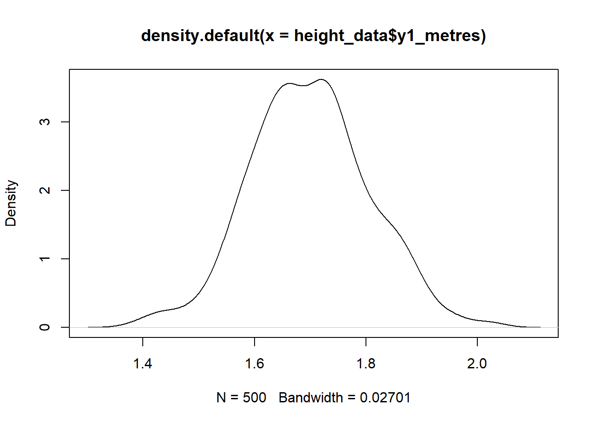
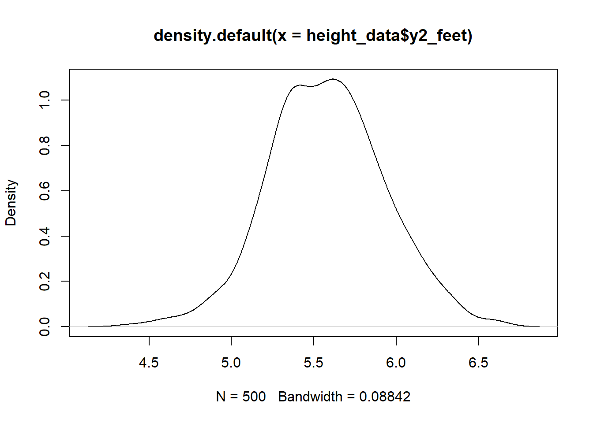
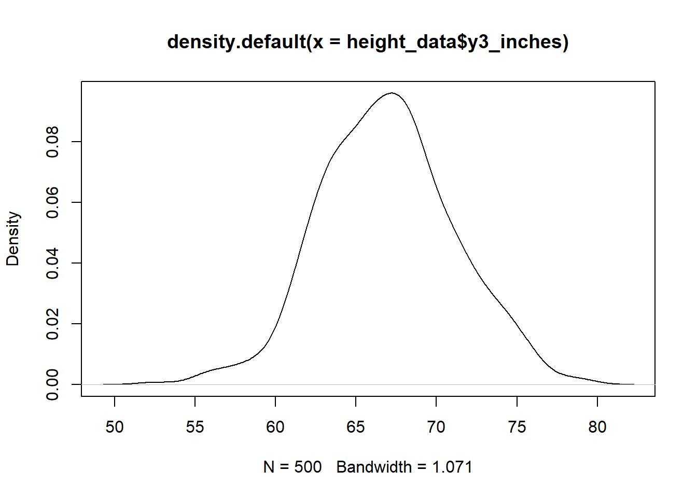

---
editor_options:
  markdown:
    wrap: 72
---

# Confirmatory Factor Analysis: Simulating Height {.unnumbered}

Let's load the relevant packages first. 


```r
library(lavaan)
library(tidyverse)
```

In this demonstration, we will simulate three observed measurements: one measure taken in meters, one in feet, and one in inches. We are then going to analyse these measures with a CFA model, and see how it deals with the different measurement scales. For those of you not familiar with feet and inches, they are archaic measurements of length that, although they have been superseded by a more modern measurement unit - the metre - are still in common use in the UK for certain things, notably height. They relate to metres as follows:  

1 metre =  3.28 feet   (1 foot = 1/3.28 = 0.305 metres)   

1 metre = 39.37 inches (1 inch = 1/39.37 = 0.025 metres)                     

(There are 12 inches in one foot, i.e. 39.37/3.28 = 12)                  


In this example, these different measures will be equally "good" measures of height, i.e. they will all contain the same proportion of measurement error. The only major difference is that they will be in these different units. This example will show us how the CFA model effortlessly equates the units of different observed variables, and relates them all to the same underlying scale that is used by the latent variable.   

## Generating the Data {-}

We want to create 3 observed measurements of a person's height:  

-  **y1** will represent true height (F) plus measurement error (e), in metres  
-  **y2** will represent true height (F) plus measurement error (e), in feet  
-  **y3** will represent true height (F) plus measurement error (e), in inches  

These measurements will be generated using the CFA equation. We will start by creating a variable that reflects a persons "true" height (i.e. the latent, unobserved variable F). Then we will create variables to reflect the  measurement error for the observed measures.  

We will create observed height measures as follows:  

-  observed_height_1 = true_height + measurement error_1  
-  observed_height_2 = true_height + measurement error_2  
-  observed_height_3 = true_height + measurement error_3  

The equations above are nothing but a simple CFA model, one which does not have  any item intercepts or factor loadings. An equivalent way to think of it is that the intercepts and loadings are the same for measurements 1 to 3. The additional thing we will do is we will re-scale the measures so that 2 and 3 reflect measurements taken in feet and inches, respectively. 

When we have simulated these three observed, error prone measures of height in the three units, we will analyse the data with a CFA model and watch how, as if by magic, the model uses the loading and intercept parameters of the model to recover the measurement units of the three measurement units.   


Height will be simulated based on European data from: https://en.wikipedia.org/wiki/Average_human_height_by_country   

Where:  

-  **f** = true height: mean 1.7 m, sd = 0.10 m   
-  **e** = measurement error: mean 0, sd = 0.02 m  
       
This means that the observed measures of height will vary from the true height by 2 cm on average. 

We will generate three observed measures of height (**y1**, **y2**, **y3**), each with it's own measurement error. The sample size will be $N = 500$. 


First, we create a dataframe with the true height (**f**) and the measurement errors **e1**, **e2**, and **e3**.


```r
set.seed(1234)

height_data <- data.frame(f = rnorm(500, 1.7, 0.1 ), e1 = rnorm(500, 0, 0.02), 
                          e2 = rnorm(500,   0, 0.02), e3 = rnorm(500, 0, 0.02)
                          )
```


The `rnorm(n, mean, sd)` function will generate $n$ observations, each drawn randomly from a normal distribution with the specified mean and standard deviation. 


Let's now create the observed variables. **y1** is already in metres, so we don't need to re-scale it, **y2** needs to be re-scaled to represent feet (i.e. we must multiply its values by 3.28), and **y3** needs to be re-scaled to represent inches (i.e. we must multiply its values by 39.37)


```r
height_data <- height_data %>%
  mutate(y1_metres =  f + e1, 
         y2_feet   = (f + e2)*3.28, 
         y3_inches = (f + e3)*39.37
         )
```

Let's have a look at the data


```r
plot(density(height_data$y1_metres))
```



```r
plot(density(height_data$y2_feet))
```



```r
plot(density(height_data$y3_inches))
```



Note that the distributions are on the different scales (metres, feet, inches), and are slightly different shapes because of measurement error.

For a summary of the descriptive statistics:


```r
desc_stats <- data.frame(
  Mean = sapply(height_data, mean),
  Median = sapply(height_data, median),
  SD = sapply(height_data, sd)
  )

print(desc_stats)
```

```
##                    Mean       Median         SD
## f          1.7001838821  1.697929266 0.10348139
## e1        -0.0011006645 -0.001267044 0.01917183
## e2         0.0006335859  0.001332594 0.01875223
## e3        -0.0000532562 -0.001031528 0.02047146
## y1_metres  1.6990832176  1.697436416 0.10677492
## y2_feet    5.5786812949  5.571993572 0.34980698
## y3_inches 66.9341427404 66.808852838 4.14919324
```

And correlations: 


```r
cor(height_data)
```

```
##                      f          e1          e2           e3   y1_metres
## f          1.000000000  0.08188932  0.08086834 -0.004835441 0.983858046
## e1         0.081889315  1.00000000 -0.02650801  0.032107889 0.258917123
## e2         0.080868336 -0.02650801  1.00000000 -0.009471980 0.073614301
## e3        -0.004835441  0.03210789 -0.00947198  1.000000000 0.001078801
## y1_metres  0.983858046  0.25891712  0.07361430  0.001078801 1.000000000
## y2_feet    0.984522857  0.07479654  0.25429895 -0.006357324 0.967584768
## y3_inches  0.980953427  0.08664333  0.07756414  0.189497465 0.966252575
##                y2_feet  y3_inches
## f          0.984522857 0.98095343
## e1         0.074796539 0.08664333
## e2         0.254298951 0.07756414
## e3        -0.006357324 0.18949746
## y1_metres  0.967584768 0.96625257
## y2_feet    1.000000000 0.96546091
## y3_inches  0.965460915 1.00000000
```

The observed height measures (**y1_metres**, **y2_feet**, **y3_inches**) are very, very highly correlated, as we would expect. They are basically the same measure, with just a bit of measurement error added in.


## CFA Models of the Data {-}

Let's now specify our CFA model using the three observed measures (metres, feet, inches) of true height. 


```r
height_metres <- ' Height =~ y1_metres + y2_feet + y3_inches '
```

We read the above model as follows:    

*the latent variable Height is indicated by `=~` three observed variables: y1_metres, y2_feet, and y3_inches.*   

Let's fit the model to the data.


```r
fit_height_metres <- cfa(height_metres, data = height_data)
```

And have a look at the results. 


```r
summary(fit_height_metres, standardized = TRUE, rsquare = T)
```

```
## lavaan 0.6-18 ended normally after 42 iterations
## 
##   Estimator                                         ML
##   Optimization method                           NLMINB
##   Number of model parameters                         6
## 
##   Number of observations                           500
## 
## Model Test User Model:
##                                                       
##   Test statistic                                 0.000
##   Degrees of freedom                                 0
## 
## Parameter Estimates:
## 
##   Standard errors                             Standard
##   Information                                 Expected
##   Information saturated (h1) model          Structured
## 
## Latent Variables:
##                    Estimate  Std.Err  z-value  P(>|z|)   Std.lv  Std.all
##   Height =~                                                             
##     y1_metres         1.000                               0.105    0.984
##     y2_feet           3.273    0.039   84.821    0.000    0.344    0.983
##     y3_inches        38.774    0.466   83.185    0.000    4.070    0.982
## 
## Variances:
##                    Estimate  Std.Err  z-value  P(>|z|)   Std.lv  Std.all
##    .y1_metres         0.000    0.000    9.632    0.000    0.000    0.032
##    .y2_feet           0.004    0.000    9.937    0.000    0.004    0.033
##    .y3_inches         0.616    0.059   10.413    0.000    0.616    0.036
##     Height            0.011    0.001   15.306    0.000    1.000    1.000
## 
## R-Square:
##                    Estimate
##     y1_metres         0.968
##     y2_feet           0.967
##     y3_inches         0.964
```

The section `Latent variables` shows the model coefficients. First, under `Height =~`, are the factor loadings.  

The column `Estimate` shows the raw, unstandardised loadings. The unstandardised loading for meters is $1.000$. This was fixed to exactly $1$ to identify the scale of the latent variable. This means that the latent variable is measured in exactly the same units of measurement as is the observed variable **y1_metres**. The latent variable is therefore measured in meters. This means that a one-unit change in the LV results in a one-unit change in observed height in meters.  

The unstandardised loading for **y2_feet** is $3.27$, i.e. a 1 unit change in the LV (which is in meters) results in $3.27$ units change in feet. This is pretty much what we would expect, because a meter is about $3.27$ feet. Ideally it should be $3.28$, but our measurement error must have a mean that is not quite exactly zero.  

We apply the same interpretation for **y3_inches**. The unstandardised loading is $38.77$, which is pretty close to the known scaling factor of $39.37$ (i.e. we know that there are $39.37$ inches in a metre).  

So, this is what the unstandardised loadings tell us: they tell us the scale of measurement of each of the indicators, in relation to the scale of the variable with its loading fixed to one. By fixing one of the loadings to one, we fix the scale of the latent variable to the same scale as that variable.  

Notice that both of the loadings for **y2_feet** and **y3_inches** are underestimates of what we know to be the true scaling factors. This is because of the measurement error.  

How much have they been underestimated? We can see this in the standardised loadings. The standardized loadings are in the column `Std.all`. These have been re-scaled to represent units of standard deviations. The standardised loadings are all about the same for all three measures, just over $0.98$. This is because the measurement error that we added was quite small just $2$ cm on average, which is just over $1\%$ of the average height of $1.7$ m. We can see from these standardised loadings that, despite their very different scales of measurement, these three measures are all about the same when we take into account how variable they are in their own units. When we put them into the same units, i.e. SDs, they are all about the same.  

How much measurement error do our measures contain? To get this we must look at the $R^2$ values at the end of the output. These are the proportion of variance in the observed variables that is accounted for by the latent variable. The $R^2$ estimates are all $0.96-0.97$, which means that about $97\%-98\%$ of the variance in each of the observed variables is accounted for by the latent variable, and only the remaining $2\%-3\%$ is measurement error. This is a very good result, showing that these are all very good, reliable, measures of the latent variable.  


## BONUS {-}

*What happens if we use "feet" as the reference item to scale the LV?*


```r
height_feet <- ' Height =~ y2_feet + y1_metres + y3_inches '

fit_height_feet <- cfa(height_feet, data = height_data)

summary(fit_height_feet, standardized = TRUE, rsquare = T)
```

```
## lavaan 0.6-18 ended normally after 45 iterations
## 
##   Estimator                                         ML
##   Optimization method                           NLMINB
##   Number of model parameters                         6
## 
##   Number of observations                           500
## 
## Model Test User Model:
##                                                       
##   Test statistic                                 0.000
##   Degrees of freedom                                 0
## 
## Parameter Estimates:
## 
##   Standard errors                             Standard
##   Information                                 Expected
##   Information saturated (h1) model          Structured
## 
## Latent Variables:
##                    Estimate  Std.Err  z-value  P(>|z|)   Std.lv  Std.all
##   Height =~                                                             
##     y2_feet           1.000                               0.344    0.983
##     y1_metres         0.305    0.004   84.821    0.000    0.105    0.984
##     y3_inches        11.845    0.144   82.262    0.000    4.070    0.982
## 
## Variances:
##                    Estimate  Std.Err  z-value  P(>|z|)   Std.lv  Std.all
##    .y2_feet           0.004    0.000    9.937    0.000    0.004    0.033
##    .y1_metres         0.000    0.000    9.632    0.000    0.000    0.032
##    .y3_inches         0.616    0.059   10.413    0.000    0.616    0.036
##     Height            0.118    0.008   15.282    0.000    1.000    1.000
## 
## R-Square:
##                    Estimate
##     y2_feet           0.967
##     y1_metres         0.968
##     y3_inches         0.964
```


The model has the same fit measures and standardised loadings and $R^2$, but the unstandardised loadings and residual variances have been re-scaled to represent measurements in feet. (i.e. a foot is about a third of a metre, and there are about 12 inches to a foot)

